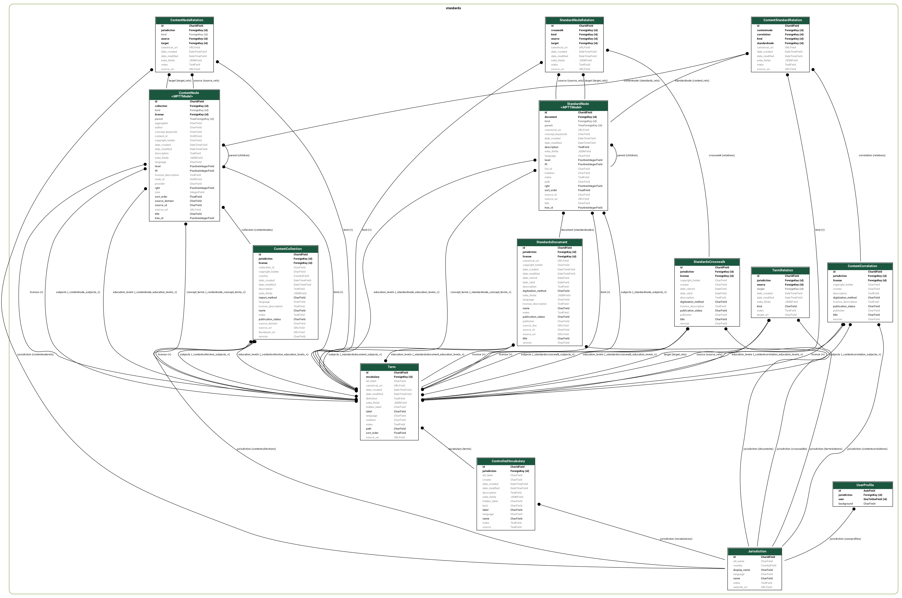
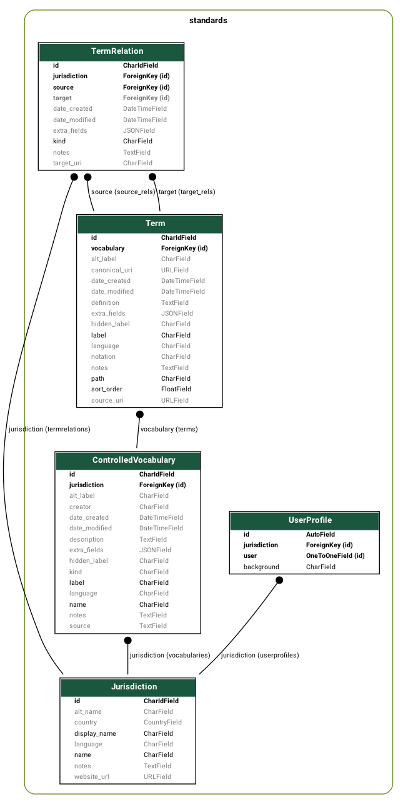
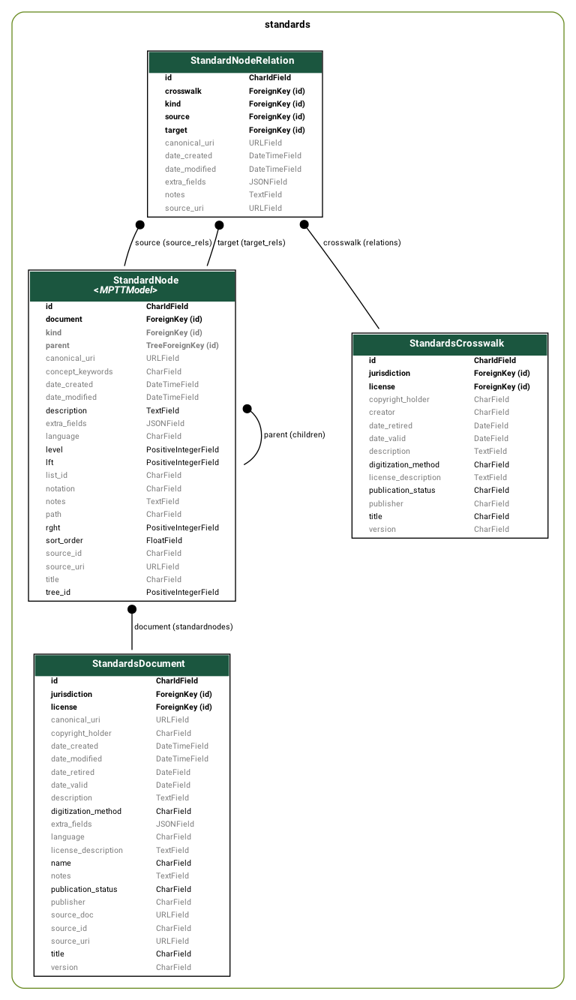
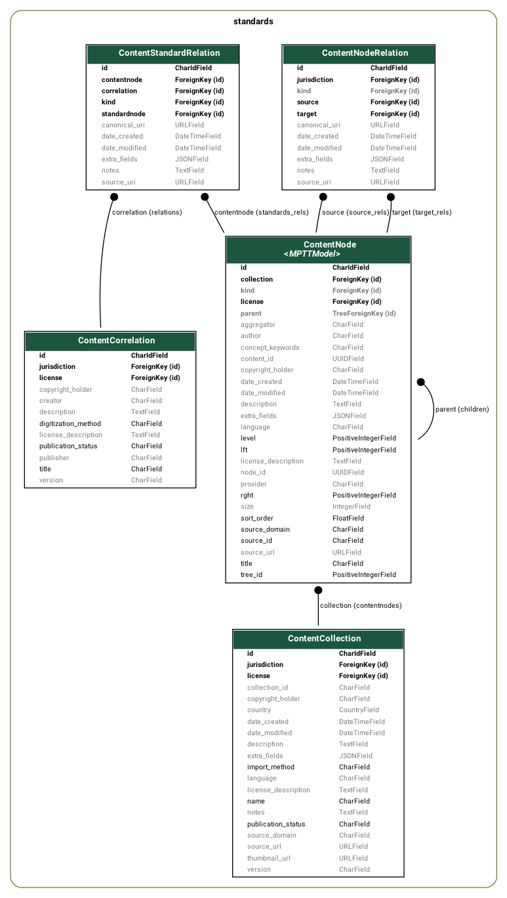

ROC Data Model
==============
The Repository Organized Curriculums (ROC) data model consists can be used to
curriculum alignment data including curriculum standards, content correlations
(content-standard links), and standards crosswalks (standard-standard links).

The summary section provides a condensed overview of all objects, with more details
provided in following sections.

Summary
-------
The following list contains all the different types of objects in the ROC data model.
For each model, we provide links to the model definition (Django model class),
auto-generated "rocdocs", schema notes, and an example.

 - Jurisdiction: a country or an organization that publishes curriculum data.
   [model](https://github.com/rocdata/rocserver/blob/main/standards/models/jurisdictions.py),
   [rocdocs](https://rocdata.global/rocdocs/models/standards.jurisdiction/),
   [example](https://rocdata.global/Ghana).
 - Vocabularies and terms: are used to represent constants within each a jurisdiction (e.g. academic subjects, and grade levels)
   - ControlledVocabulary:
     [model](https://github.com/rocdata/rocserver/blob/main/standards/models/terms.py),
     [rocdocs](https://rocdata.global/rocdocs/models/standards.jurisdiction/),
     [example](https://rocdata.global/Ghana/terms/GradeLevelsa).
   - Term:
     [model](https://github.com/rocdata/rocserver/blob/main/standards/models/terms.py),
     [rocdocs](https://rocdata.global/rocdocs/models/standards.term/),
     [example](https://rocdata.global/Ghana/terms/GradeLevels/B4).
 - Standards:
   - StandardsDocument:
     [model](https://github.com/rocdata/rocserver/blob/main/standards/models/standards.py),
     [schema](https://docs.google.com/spreadsheets/d/1LlGmqrse23iZmnu736HlBUr1Pfg6MzN36LY-TGbbgyM/edit#gid=1816073745&range=G1:M28),
     [rocdocs](https://rocdata.global/rocdocs/models/standards.standardsdocument/),
     [example](https://rocdata.global/USA/documents/DayhBeyn).
   - StandardNode:
     [model](https://github.com/rocdata/rocserver/blob/main/standards/models/standards.py),
     [schema](https://docs.google.com/spreadsheets/d/1LlGmqrse23iZmnu736HlBUr1Pfg6MzN36LY-TGbbgyM/edit#gid=1795159382&range=G1:M26),
     [rocdocs](https://rocdata.global/rocdocs/models/standards.standardnode/),
     [example](https://rocdata.global/USA/standardnodes/SWcNceyR).
 - Content:
   - ContentCollection:
     [schema](https://docs.google.com/spreadsheets/d/1LlGmqrse23iZmnu736HlBUr1Pfg6MzN36LY-TGbbgyM/edit#gid=1787593016&range=N1:T121),
     [model](https://github.com/rocdata/rocserver/blob/main/standards/models/content.py),
     [rocdocs](https://rocdata.global/rocdocs/models/standards.contentcollection/),
     [example](https://rocdata.global/KA/contentcollections/CCBwpakEViFm).
   - ContentNode:
     [schema](https://docs.google.com/spreadsheets/d/1LlGmqrse23iZmnu736HlBUr1Pfg6MzN36LY-TGbbgyM/edit#gid=1787593016&range=N1:T100),
     [model](https://github.com/rocdata/rocserver/blob/main/standards/models/content.py),
     [rocdocs](https://rocdata.global/rocdocs/models/standards.contentnode/),
     [example](https://rocdata.global/KA/contentnodes/CgmdGCdPmHR).

The ROC data model can also represent the following types of relations:
 - TermRelation:
   [model](https://github.com/rocdata/rocserver/blob/main/standards/models/terms.py),
   [rocdocs](https://rocdata.global/rocdocs/models/standards.termrelation/).
 - ContentNodeRelation:
   [model](https://github.com/rocdata/rocserver/blob/main/standards/models/content.py),
   [rodocs](https://rocdata.global/rocdocs/models/standards.contentnoderelation/).
 - Content correlations:
   [model](https://github.com/rocdata/rocserver/blob/main/standards/models/content.py),
   [rodocs](https://rocdata.global/rocdocs/models/standards.contentcorrelation/),
   [example](https://rocdata.global/KA/contentcorrelations/CS5usCvLx).
   - ContentStandardNodeRelation:
     [schema](https://docs.google.com/spreadsheets/d/1LlGmqrse23iZmnu736HlBUr1Pfg6MzN36LY-TGbbgyM/edit#gid=1389077609&range=J1:P33),
     [model](https://github.com/rocdata/rocserver/blob/main/standards/models/content.py),
     [rocdocs](https://rocdata.global/rocdocs/models/standards.contentstandardrelation/),
     [example](https://rocdata.global/KA/contentstandardrels/CSRCEjJkLifCV).
 - Standards crosswalks:
   [model](https://github.com/rocdata/rocserver/blob/main/standards/models/standards.py),
   [rocdocs](https://rocdata.global/rocdocs/models/standards.standardscrosswalk/),
   [example](https://rocdata.global/USA/standardscrosswalks/SCS6RJNzt).
   - StandardNodeRelation:
     [schema](https://docs.google.com/spreadsheets/d/1LlGmqrse23iZmnu736HlBUr1Pfg6MzN36LY-TGbbgyM/edit#gid=1579970957&range=I1:O31),
     [model](https://github.com/rocdata/rocserver/blob/main/standards/models/standards.py),
     [rocdocs](https://rocdata.global/rocdocs/models/standards.standardnoderelation/),
     [example](https://rocdata.global/USA/standardnoderels/SRjspSd43).

Prior work
----------
The Repository of Organized Curriculums (ROC) data model is heavily inspired by
the following prior work:
 - [ASN schema](http://www.achievementstandards.org/content/how-asn-works)
   for curriculum standards and content correlations
 - [CASE schemas](http://www.imsglobal.org/activity/case) for curriculum standards
 - [LRMI specifications](https://www.dublincore.org/specifications/lrmi/lrmi_terms/2020-11-12/) for content correlations
 - [Studio](https://github.com/learningequality/studio/blob/develop/contentcuration/contentcuration/models.py)
   and [Kolibri](https://github.com/learningequality/kolibri/blob/develop/kolibri/core/content/models.py#L150-L252)
   data model for content collections (channels) and content nodes

Overview of all models
----------------------

Jurisdictions
-------------

 - Jurisdiction: a country or an organization that publishes curriculum data.
   [model](https://github.com/rocdata/rocserver/blob/main/standards/models/jurisdictions.py),
   [rocdocs](https://rocdata.global/rocdocs/models/standards.jurisdiction/),
   [example](https://rocdata.global/Ghana).

Controlled vocabularies and terms
---------------------------------

<!-- TODO: figure out how to include images in docs build
<figure class="figure float-right">
  
  <figcaption class="figure-caption">Jurisdictions, controlled vocabularies and terms data classes.</figcaption>
</figure> -->

 - Vocabularies and terms: are used to represent constants within each a jurisdiction (e.g. academic subjects, and grade levels)
   - ControlledVocabulary:
     [model](https://github.com/rocdata/rocserver/blob/main/standards/models/terms.py),
     [rocdocs](https://rocdata.global/rocdocs/models/standards.jurisdiction/),
     [example](https://rocdata.global/Ghana/terms/GradeLevelsa).
   - Term:
     [model](https://github.com/rocdata/rocserver/blob/main/standards/models/terms.py),
     [rocdocs](https://rocdata.global/rocdocs/models/standards.term/),
     [example](https://rocdata.global/Ghana/terms/GradeLevels/B4).
 - TermRelation:
   [model](https://github.com/rocdata/rocserver/blob/main/standards/models/terms.py),
   [rocdocs](https://rocdata.global/rocdocs/models/standards.termrelation/).

Standards
---------

 - StandardsDocument:
   [model](https://github.com/rocdata/rocserver/blob/main/standards/models/standards.py),
   [schema](https://docs.google.com/spreadsheets/d/1LlGmqrse23iZmnu736HlBUr1Pfg6MzN36LY-TGbbgyM/edit#gid=1816073745&range=G1:M28),
   [rocdocs](https://rocdata.global/rocdocs/models/standards.standardsdocument/),
   [example](https://rocdata.global/USA/documents/DayhBeyn).
   - StandardNode:
     [model](https://github.com/rocdata/rocserver/blob/main/standards/models/standards.py),
     [schema](https://docs.google.com/spreadsheets/d/1LlGmqrse23iZmnu736HlBUr1Pfg6MzN36LY-TGbbgyM/edit#gid=1795159382&range=G1:M26),
     [rocdocs](https://rocdata.global/rocdocs/models/standards.standardnode/),
     [example](https://rocdata.global/USA/standardnodes/SWcNceyR).
 - Standards crosswalks:
   [model](https://github.com/rocdata/rocserver/blob/main/standards/models/standards.py),
   [rocdocs](https://rocdata.global/rocdocs/models/standards.standardscrosswalk/),
   [example](https://rocdata.global/USA/standardscrosswalks/SCS6RJNzt).
   - StandardNodeRelation:
     [schema](https://docs.google.com/spreadsheets/d/1LlGmqrse23iZmnu736HlBUr1Pfg6MzN36LY-TGbbgyM/edit#gid=1579970957&range=I1:O31),
     [model](https://github.com/rocdata/rocserver/blob/main/standards/models/standards.py),
     [rocdocs](https://rocdata.global/rocdocs/models/standards.standardnoderelation/),
     [example](https://rocdata.global/USA/standardnoderels/SRjspSd43).

Content
-------

 - ContentCollection:
   [schema](https://docs.google.com/spreadsheets/d/1LlGmqrse23iZmnu736HlBUr1Pfg6MzN36LY-TGbbgyM/edit#gid=1787593016&range=N1:T121),
   [model](https://github.com/rocdata/rocserver/blob/main/standards/models/content.py),
   [rocdocs](https://rocdata.global/rocdocs/models/standards.contentcollection/),
   [example](https://rocdata.global/KA/contentcollections/CCBwpakEViFm).
   - ContentNode:
     [schema](https://docs.google.com/spreadsheets/d/1LlGmqrse23iZmnu736HlBUr1Pfg6MzN36LY-TGbbgyM/edit#gid=1787593016&range=N1:T100),
     [model](https://github.com/rocdata/rocserver/blob/main/standards/models/content.py),
     [rocdocs](https://rocdata.global/rocdocs/models/standards.contentnode/),
     [example](https://rocdata.global/KA/contentnodes/CgmdGCdPmHR).
 - ContentNodeRelation:
   [model](https://github.com/rocdata/rocserver/blob/main/standards/models/content.py),
   [rodocs](https://rocdata.global/rocdocs/models/standards.contentnoderelation/).
 - Content correlations:
   [model](https://github.com/rocdata/rocserver/blob/main/standards/models/content.py),
   [rodocs](https://rocdata.global/rocdocs/models/standards.contentcorrelation/),
   [example](https://rocdata.global/KA/contentcorrelations/CS5usCvLx).
   - ContentStandardNodeRelation:
     [schema](https://docs.google.com/spreadsheets/d/1LlGmqrse23iZmnu736HlBUr1Pfg6MzN36LY-TGbbgyM/edit#gid=1389077609&range=J1:P33),
     [model](https://github.com/rocdata/rocserver/blob/main/standards/models/content.py),
     [rocdocs](https://rocdata.global/rocdocs/models/standards.contentstandardrelation/),
     [example](https://rocdata.global/KA/contentstandardrels/CSRCEjJkLifCV).

